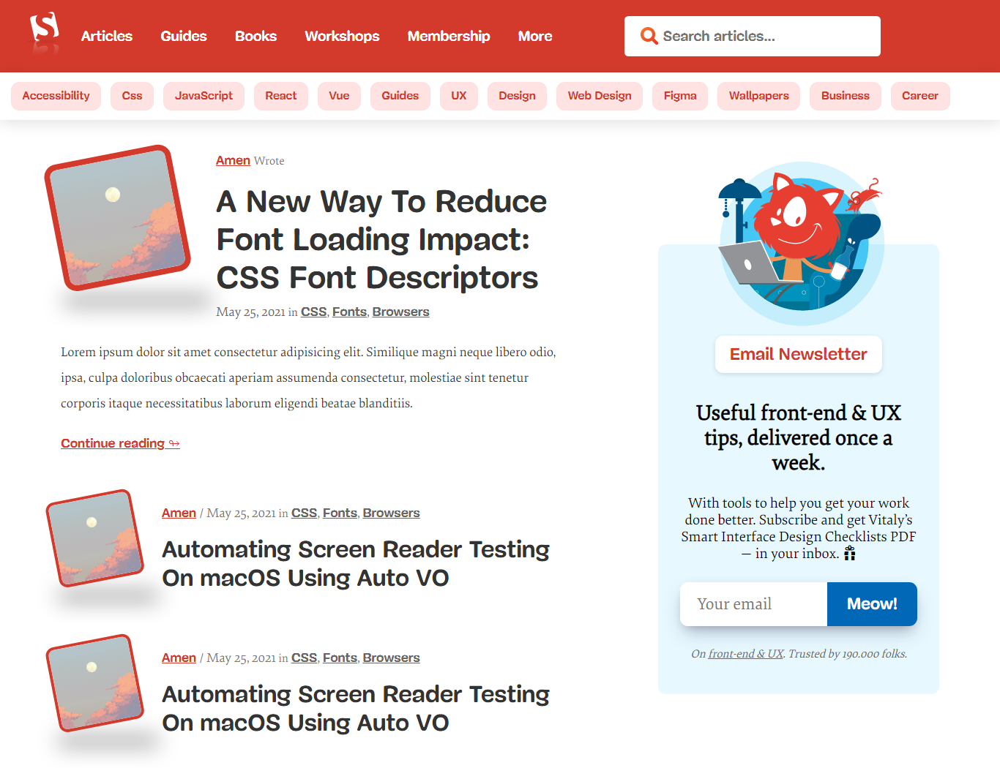

# Smashing-Magazin-Clone

 The goal for this exercise is to start training yourself to think in terms of visual hierarchy, typography and design principles. Breaking the website for pieces and recombine the most important one in your own order. I have used only **Html** and **Css**.
> It's not dynamic 
---
## Screenshot

---
## Full Page Capture
- [Png](images/smashing-magazine-full-clone.png)

- [Pdf](pdf/gofullpage.pdf)