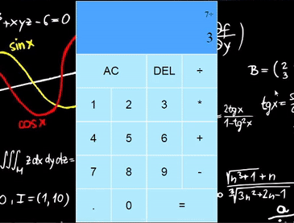

# Calculator

> Hovering over calculator buttons 

---

## Description
It's a web app where users can do basic calculations, **addition, subtraction, division and mutliplication.**
## How To Use
 Theres two way to do calculations, both are easy
  - First one is by **clicking** on the calculator buttons.

  - Second one is using the **keyboard**, `+,-,*,/` are `addition, subtraction, division and mutliplication` *by order*, `Esc` will `Clear` everything, `Backspace` will `Delete` one digit, `Enter` or `=` will `Calculate`, and finally to `add numbers` just **click on numbers** ;).
---
