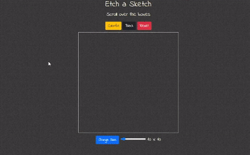

# Etch a Sketch

> Drawing 

---

## Description

 The Etch-a-Sketch is a web game where users create pixel art, they have two options, black boxes, or colorful boxes, they also can change the boxes numbers.

## How To Use
 You just need to **hover** over the boxes! By hovering over the boxes their color will change.

 - ### Colors
 To change the drawing color to black, just click on the `Black` button, to make it return to **default** click on the `Colorful` button. The `Reset` button will clear all boxes.

 - ### Size
 To change the size, move the slider to the size you want, **16 x 16** for example, and click on `Change Size`, the size will change and the boxes will get transparent till you hover over them another time.
    
---
