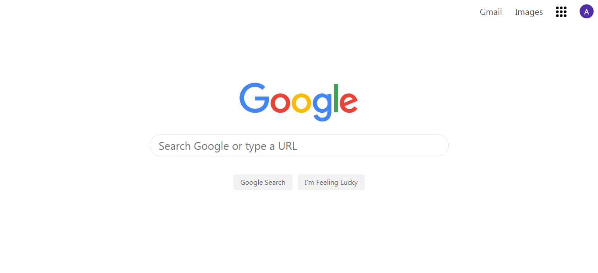

# Google-homepage

In this *mini-project*, you should deconstruct the google homepage and rebuild it. The goal is to start thinking about how elements get placed on the page, distribute, and a little bit of how they get styled and aligned.

---
## Screenshot

