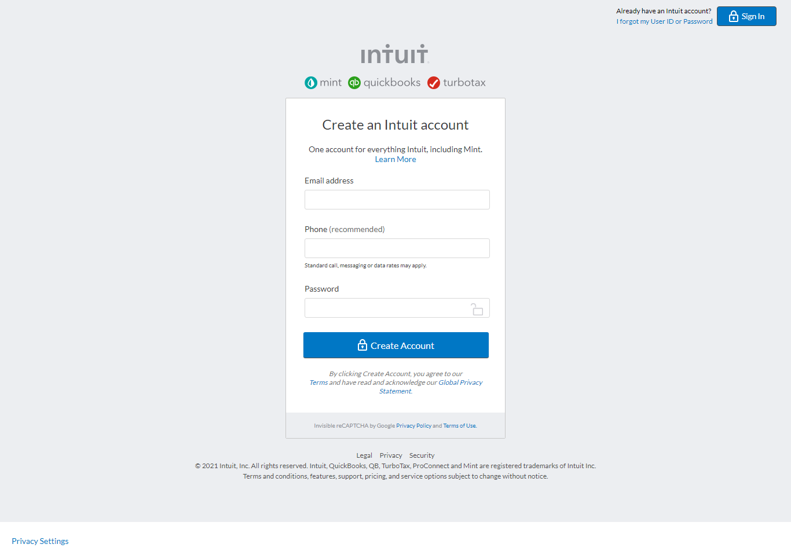

# Mint Clone
 In this project, i cloned [Mint](Mint.com) website. You didn't need to do anything dynamic functionality, the point is to make it look like the real page as much as you can.

---

## Screenshot

 
