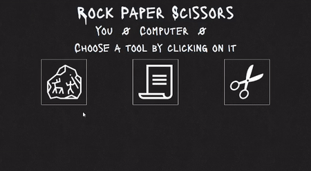

# Rock Paper Scissor

> Gameplay

---

## Description

 This Rock Paper Scissor is a web game where users can play against the computer (ai), if someone's score reaches **5**, the game will end and he will get the win.

## How To Use
 It's very simple to use, just clicking on his choice image, the sentence will explain if he won or lose, and what did the computer choose, `You Won, Paper Beats Rock!` 

 The score will automatically increase when the score reach **5**, the winner will be announced, and the user wouldn't be able to click on anything but the `Restart` button, the **Restart** button will return the score to zero, and he will be able to play normally again.

 
 > The scissor button doesn't work after the game end

---
