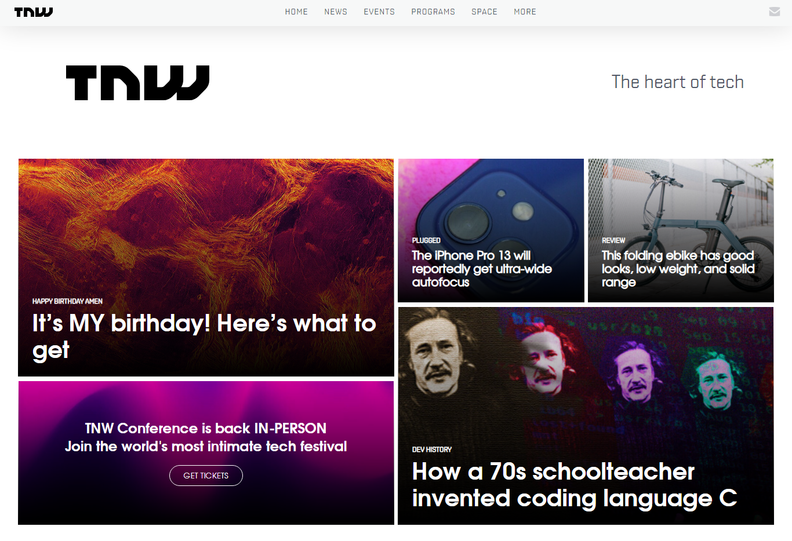

# The-next-web
The goal for this project is to use media queries to gracefully degrade the site as the window size is reduced. I also discovered about `object-fit` property and `clamp`, and i got more comfortable at using **Grid**. I have used only **Html** and **Css**.
___

# Screenshot

> That's the header of the desktop display
___

# Fullscreen Capture

- [Desktop-width](pdf/desktop-view.pdf)
- [768px/1024px](pdf/768-1024.pdf)
- [Less than 768px](pdf/less-than-768.pdf)