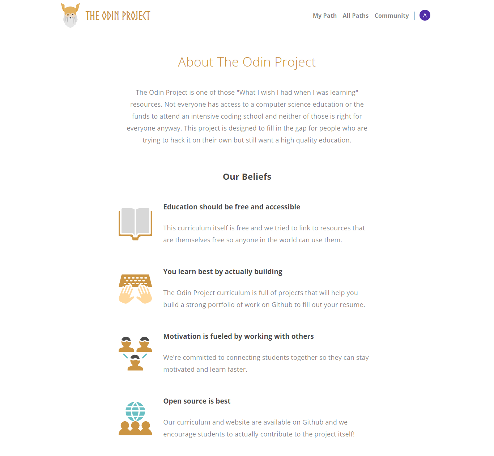

# The-Odin-Project 
This is the final **Html** and **Css** project, the goal is to build my own simple **12-column** grid-based framework and using it to clone any specific website, it should be responsive. I used **Sass** to build it.
___

## Screenshot

## FullScreen Capture

[Desktop Pdf](pdf/desktop.pdf)

[Desktop Png](images/desktop.png)