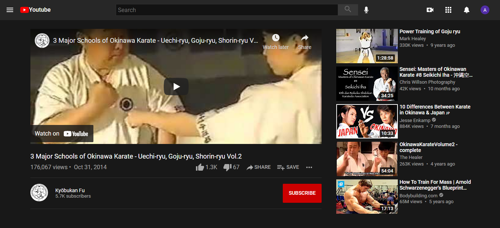

# Youtube Clone

It's a simple Youtube Clone created using Html and Css. The **goal** is to know how to embed video in the page so it actually plays. That's a part of The Odin Project [Html Css Curriculum.](https://www.theodinproject.com/paths/full-stack-javascript/courses/html-and-css)

---

# ScreenShots

> My Clone
---

